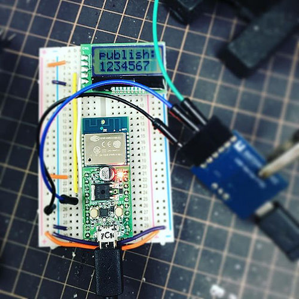

mqtt-serial-pub.ino
====

Requirements
----

  - Akiduki ESP-WROOM-02 development board
    - http://akizukidenshi.com/catalog/g/gK-12236/

  - Akiduki AE-AQM0802 LCD module
    - http://akizukidenshi.com/catalog/g/gK-06795/

  - Arduino Client for MQTT 
    - https://github.com/knolleary/pubsubclient/

  - EspSoftwareSerial
    - https://github.com/plerup/espsoftwareserial/
  
How to
----

    $ git clone https://github.com/yoggy/mqtt-serial-pub.git
    $ mqtt-serial-pub
    $ cp config.ino.sample config.ino
    $ vi config.ino
    ※ edit mqtt_host, mqtt_username, mqtt_password, topic...
    $ open mqtt-serial-pub.ino

Copyright and license
----
Copyright (c) 2018 yoggy

Released under the [MIT license](LICENSE)